<div align="center">


<h1>Edge Computing Blueprints</h1>

<p><strong>The Enterprise Standard for Distributed Infrastructure and Fleet Orchestration</strong></p>

[]()
[]()
[]()
[]()

<br/>

> **"The edge is where the digital world meets the physical world."** 
> Edge Computing Blueprints is a flagship repository designed to enable organizations to design, deploy, and operate edge workloads across globally distributed fleets through industrialized orchestration and reference architectures.

</div>

---

## 🏛️ Executive Summary

**Edge Computing Blueprints** is a flagship repository designed for Chief Technology Officers (CTOs), Infrastructure Leaders, and IoT Architects. As organizations move compute closer to the data source—whether in retail stores, factory floors, or telecom towers—the need for standardized, secure, and automated edge operations becomes critical.

This platform provides an industrialized approach to **Edge Computing**, delivering production-ready **Fleet Management**, **Offline-First Architectures**, **Edge AI Inference**, and **Multi-Region Governance**. It supports **Azure**, **AWS**, **GCP**, and **K3s/MicroK8s**, enabling organizations to transition from "Experimental Edge" to "Industrialized Edge Operations."

---

## 💡 Why Edge Computing Matters

Edge computing solves the fundamental challenges of distributed digital operations:
- **Low Latency**: Processing data locally for real-time response (e.g., autonomous vehicles, factory robotics).
- **Bandwidth Optimization**: Reducing cloud costs by filtering and aggregating data at the source.
- **Offline Resilience**: Ensuring critical local operations continue even during WAN outages.
- **Data Sovereignty**: Keeping sensitive data within regional or facility boundaries for compliance.

---

## 🚀 Business Outcomes

### 🎯 Strategic Edge Impact
- **Operational Efficiency**: Automating the lifecycle of thousands of edge sites through zero-touch provisioning.
- **Improved CX/UX**: Delivering faster, local digital experiences in retail and branch locations.
- **Risk Mitigation**: Enhancing security through edge-native identity and zero-trust networking.
- **New Revenue Streams**: Enabling Edge AI use cases like real-time retail analytics and predictive maintenance.

---

## 🏗️ Technical Stack

| Layer | Technology | Rationale |
|---|---|---|
| **Fleet Engine** | Python, Ansible, GitOps | High-performance orchestration of globally distributed edge workloads and updates. |
| **Control Plane** | FastAPI | High-performance API for site registration, telemetry, and fleet management. |
| **Frontend** | React 18, Vite | Premium portal for executive dashboards, site health, and cost insights. |
| **IaC Foundation** | Terraform | Multi-cloud infrastructure consistency and edge foundation automation. |
| **Database** | PostgreSQL | Centralized repository for fleet inventory, deployment state, and history. |
| **Edge Runtime** | K3s / Docker | Lightweight, cloud-native runtimes optimized for constrained edge environments. |
| **Observability** | Prometheus / Grafana | Real-time monitoring of site connectivity, update success, and sync lag. |

---

## 📐 Architecture Storytelling: 70+ Diagrams

### 1. Executive High-Level Architecture
The holistic vision of the enterprise edge journey.

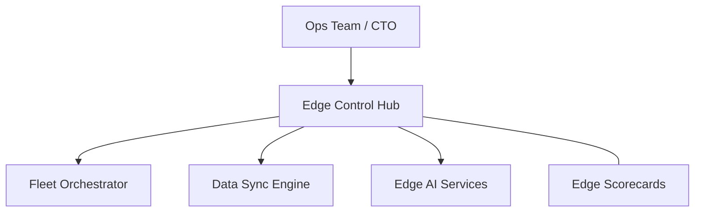

### 2. Detailed Component Topology
The internal service boundaries and management layers of the platform.

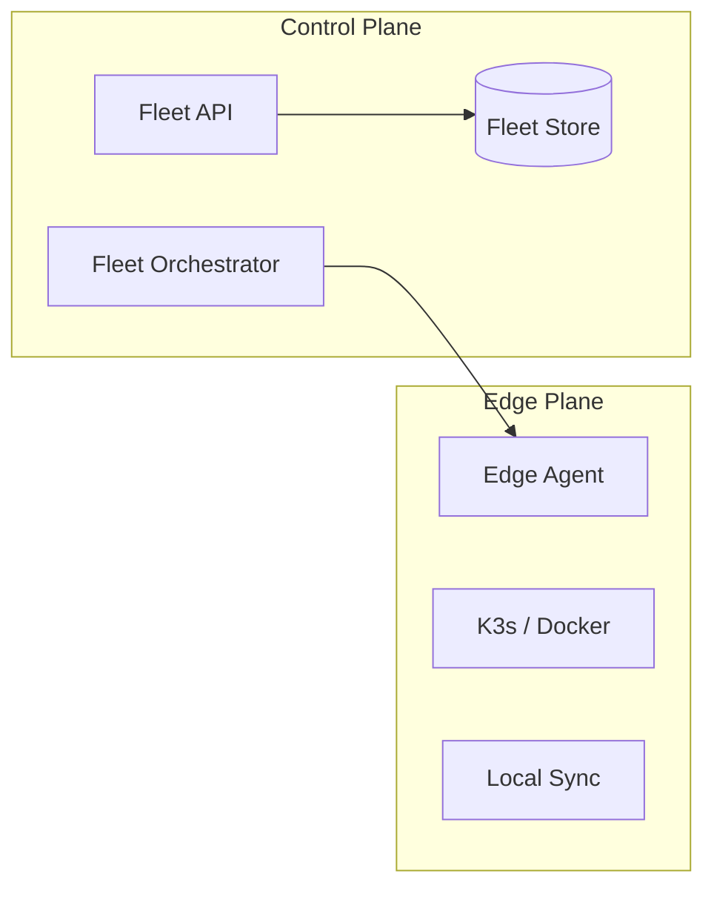

### 3. Device to Cloud Request Path
Tracing a telemetry event from an edge device through the industrialized sync stack.

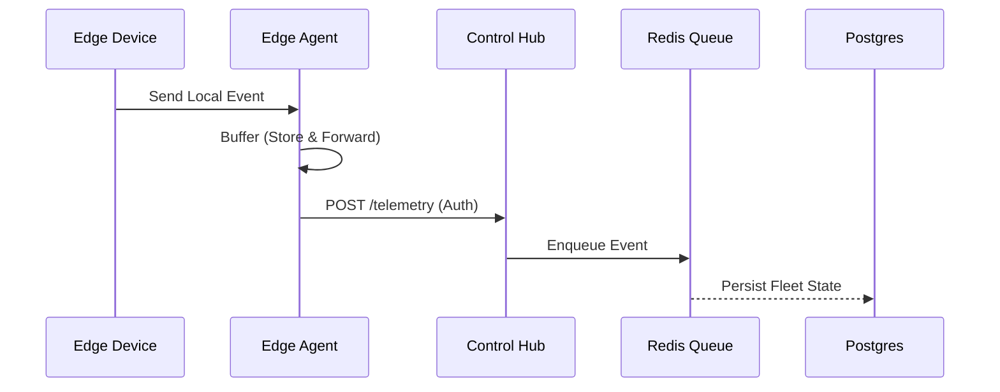

### 4. Fleet Control Plane
The "Brain" of the framework managing global edge site definitions.

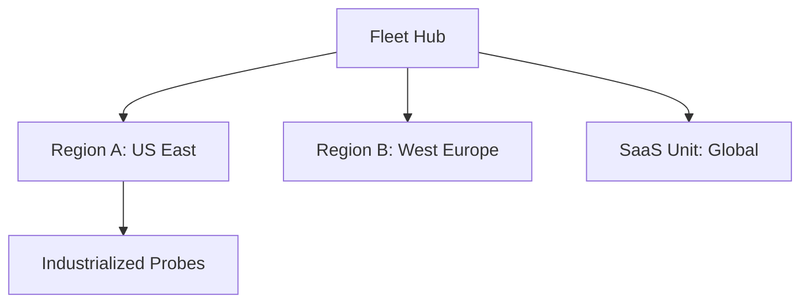

### 5. Multi-Cloud Topology
Synchronizing edge standards across Azure, AWS, and GCP.

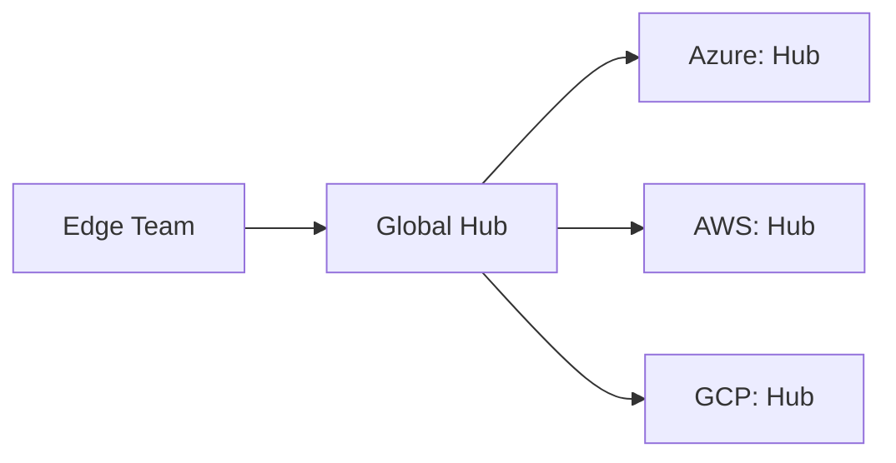

### 6. Regional Deployment Model
Hosting fleet workers and telemetry ingest close to the edge sites for performance.

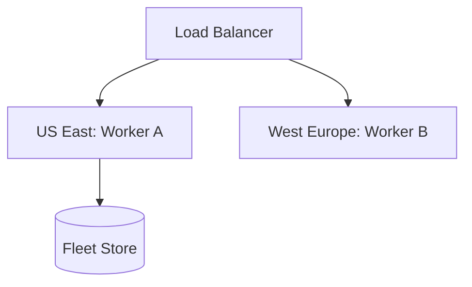

### 7. DR Failover Model
Ensuring platform continuity for the edge control plane hub itself.

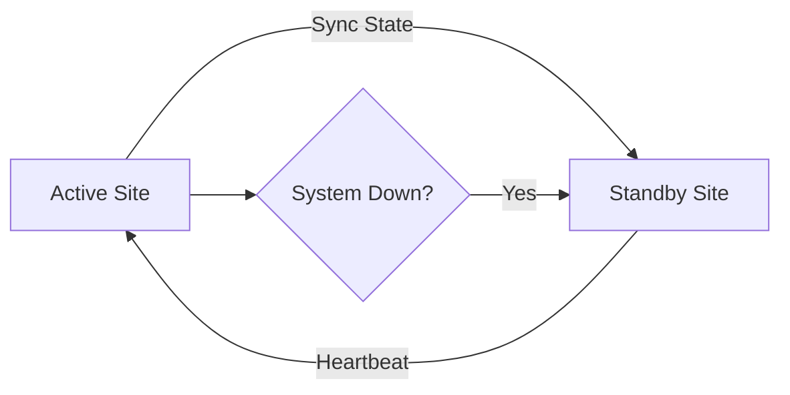

### 8. API Gateway Architecture
Securing and throttling the entry point for fleet orchestration and telemetry.

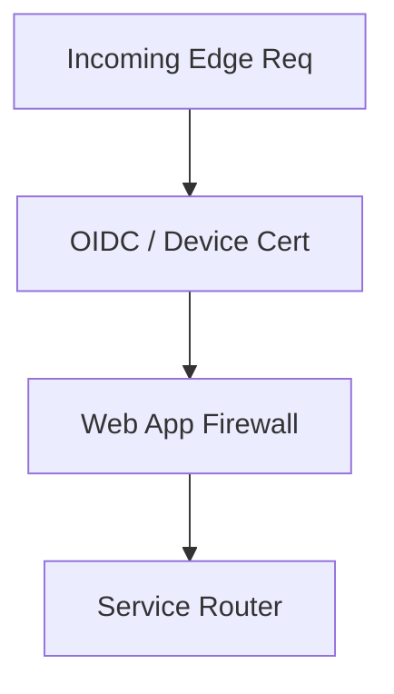

### 9. Queue Worker Architecture
Managing long-running provisioning and update tasks at scale.

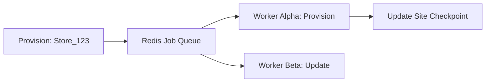

### 10. Dashboard Analytics Flow
How raw edge telemetry becomes executive engineering scorecards.

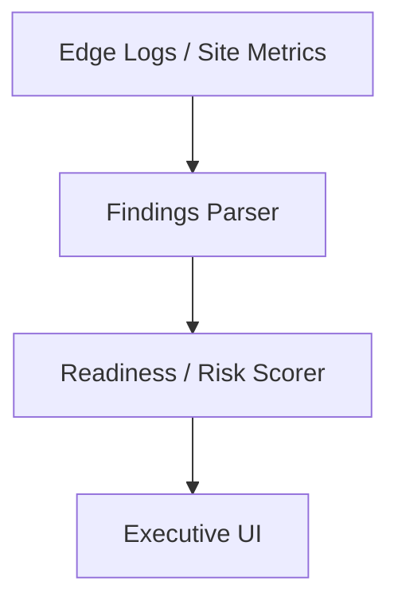

### 11. Retail Store Edge Model
Standardizing compute and local digital services for retail environments.

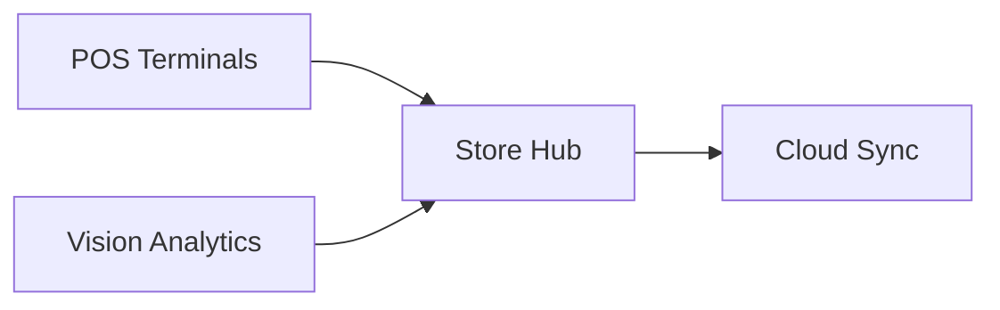

### 12. Factory Floor Edge Topology
Industrial IoT integration and local low-latency control loops.

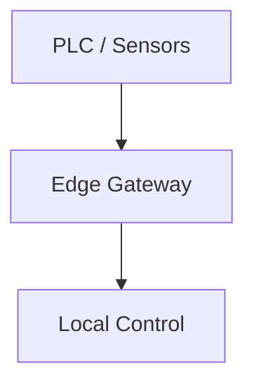

### 13. Warehouse Automation Edge
Orchestrating robotics and inventory tracking at the logistics edge.

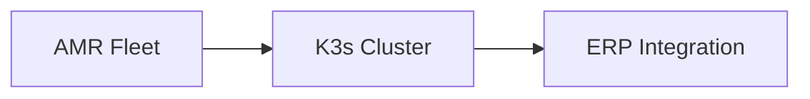

### 14. Branch Office Local Services
Maintaining critical branch operations (SD-WAN, local apps) during WAN failure.

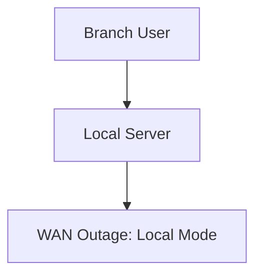

### 15. Telecom Tower Compute Node
Hosting 5G core and MEC workloads at the network edge.

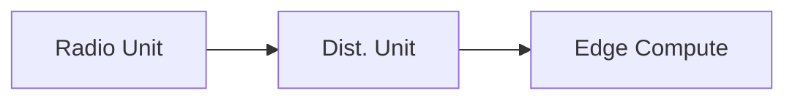

### 16. Vehicle Edge Gateway Model
Compute for autonomous driving and telematics in mobile edge environments.

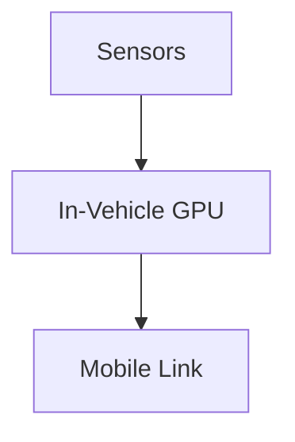

### 17. Hospital Local Processing Flow
Securing and processing patient data locally before cloud synchronization.

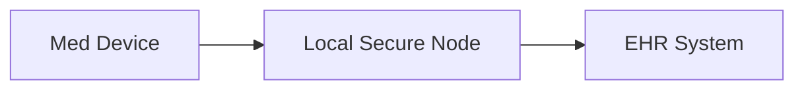

### 18. Campus Smart Building Edge
Managing HVAC, lighting, and security through distributed building controllers.

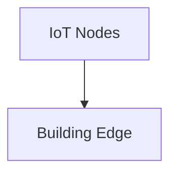

### 19. Pop-up Site Deployment Model
Rapidly deploying edge capabilities for events or temporary facilities.

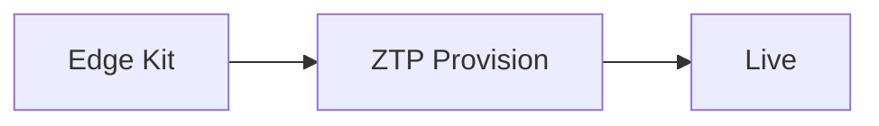

### 20. Ruggedized Hardware Topology
Designing for extreme temperatures, vibrations, and harsh environments.

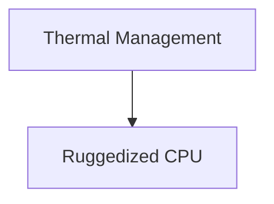

### 21. Offline-First Sync Workflow
Ensuring application availability through local data persistence and delayed sync.

```mermaid
graph LR
    Write[Local DB] --> Sync[Sync Engine] --> Cloud[Cloud DB]
```

### 22. Store-and-Forward Model
Buffering telemetry data during connectivity gaps and uploading on reconnect.

```mermaid
graph TD
    Tele[Telemetry] --> Buffer[Local Queue] --> Send[Push to Cloud]
```

### 23. WAN Outage Resilience Flow
Detecting connectivity loss and shifting applications to local-only mode.

```mermaid
graph LR
    Detect[Ping Fail] --> Mode[Shift to Local]
```

### 24. MQTT Ingestion Pipeline
High-throughput, lightweight messaging for IoT sensor data.

```mermaid
graph TD
    Sensor[Sensor] --> Broker[Local MQTT] --> Ingest[Data Svc]
```

### 25. Event Streaming Edge Model
Processing real-time event streams at the edge using NATS or Kafka.

```mermaid
graph LR
    Event[Event] --> Stream[Local Stream] --> Process[Filter]
```

### 26. Local Cache Hierarchy
Optimizing performance by caching frequently used data close to the edge.

```mermaid
graph TD
    App[App] --> L1[Local Cache] --> Cloud[Global Store]
```

### 27. Data Compression Workflow
Reducing WAN costs by compressing telemetry before transmission.

```mermaid
graph LR
    Raw[Raw JSON] --> Gzip[Compress] --> Payload[Payload]
```

### 28. Delta Sync Model
Only transmitting data changes (deltas) to minimize bandwidth usage.

```mermaid
graph TD
    V1[State v1] --> Diff[State v2: Delta] --> Sync[Push Delta]
```

### 29. Multi-Link Failover Network
Maintaining connectivity through redundant links (Fiber, 5G, Satellite).

```mermaid
graph LR
    P[Primary] --> Fail[Fail] --> S[Satellite Backup]
```

### 30. Bandwidth Shaping Strategy
Prioritizing critical operational traffic over management or non-essential data.

```mermaid
graph TD
    Traffic[All] --> Qos[QoS: Critical High]
```

### 31. Zero-Touch Provisioning Flow
Automatically configuring new edge sites upon initial power-on and connection.

```mermaid
graph LR
    Power[Power ON] --> Boot[Secure Boot] --> Pull[Pull Config]
```

### 32. GitOps Fleet Deployment
Managing edge configurations through version-controlled declarative manifests.

```mermaid
graph TD
    Git[Git Repo] --> Flux[GitOps Agent] --> K3s[Edge Site]
```

### 33. OTA Update Lifecycle
The end-to-end process of publishing and applying firmware or app updates.

```mermaid
graph LR
    Pub[Publish] --> Notify[Notify Edge] --> Apply[Apply & Reboot]
```

### 34. Blue/Green Edge Rollout
Minimizing risk by rolling out updates to a parallel "green" environment.

```mermaid
graph TD
    v1[Blue: Active] --> v2[Green: Test] --> Swap[Traffic Swap]
```

### 35. Canary Site Deployment
Testing updates on a small subset of edge sites before full fleet rollout.

```mermaid
graph LR
    Global[All Sites] --> Canary[Canary Subset]
```

### 36. Fleet Inventory Model
Maintaining a real-time record of all edge assets, versions, and health.

```mermaid
graph TD
    Site[Site ID] --> Health[Status: UP]
```

### 37. Secrets Rotation Workflow
Automatically updating edge credentials and API keys across the fleet.

```mermaid
graph LR
    Rot[Rotate] --> Hub[Hub] --> Edge[Edge Nodes]
```

### 38. Remote Shell Governance
Securing and auditing remote administrative access to edge nodes.

```mermaid
graph TD
    User[Admin] --> JIT[JIT Auth] --> Shell[Secure Shell]
```

### 39. Certificate Lifecycle Model
Automating the issuance and renewal of TLS certificates for edge identity.

```mermaid
graph LR
    Req[CSR] --> CA[Authority] --> Cert[Cert]
```

### 40. Device Decommission Process
Securely wiping and de-registering edge assets at end-of-life.

```mermaid
graph TD
    Wipe[Secure Erase] --> DeReg[Delete from Hub]
```

### 41. TPM / Secure Boot Flow
Ensuring only trusted software runs on the edge hardware.

```mermaid
graph LR
    HW[Hardware] --> TPM[Trust Root] --> OS[Verified OS]
```

### 42. Device Identity Model
Granting each edge node a unique, cryptographically verifiable identity.

```mermaid
graph TD
    ID[X.509 Cert] --> Auth[mTLS Auth]
```

### 43. Zero Trust Edge Network
Treating every edge node as untrusted and requiring constant verification.

```mermaid
graph LR
    Node[Edge] --> Policy[ZTA Policy] --> App[Protected Svc]
```

### 44. RBAC Model
Defining granular permissions for edge site operators and analysts.

```mermaid
graph TD
    Role[Site Manager] --> Perm[Manage Local Apps]
```

### 45. Incident Response Workflow
The automated and manual steps for responding to edge security alerts.

```mermaid
graph LR
    Alert[Intrusion] --> Isol[Isolate Node]
```

### 46. Metrics Pipeline
The internal monitoring of fleet performance and site health.

```mermaid
graph TD
    Agent[Agent] --> Coll[Collector] --> Metrics[Dashboard]
```

### 47. Logging Architecture
Centralized and tamper-proof logging of all edge operational events.

```mermaid
graph LR
    Log[Local Log] --> Forward[Encrypted Link] --> Hub[Audit Store]
```

### 48. Tracing Model
Tracing distributed requests across the edge-to-cloud boundary.

```mermaid
graph TD
    Edge[Edge Svc] --> Cloud[Cloud Backend]
```

### 49. SLO / Uptime Model
Measuring and alerting on site availability targets.

```mermaid
graph LR
    Uptime[99.9%] --> SLO[Target Met]
```

### 50. Local Backup Recovery Flow
Maintaining local recovery points for edge site configuration and data.

```mermaid
graph TD
    Data[Local Data] --> Backup[External Disk]
```

### 51. Vision Inference at Edge
Processing video streams locally for real-time AI object detection.

```mermaid
graph LR
    Video[Stream] --> GPU[Edge AI Model] --> Alert[Detection]
```

### 52. Predictive Maintenance Flow
Analyzing sensor data locally to predict equipment failure.

```mermaid
graph TD
    Vib[Vibration] --> Model[Anomaly Detection] --> Ticket[Repair]
```

### 53. Checkout Analytics Model
Using edge compute to analyze retail customer behavior at checkout.

```mermaid
graph LR
    Cam[Camera] --> Srv[Edge Hub] --> Insights[Wait Time]
```

### 54. Queue Length Detection Workflow
Real-time monitoring of queue sizes using local vision processing.

```mermaid
graph TD
    Count[People Count] --> Logic[Open New Register]
```

### 55. Energy Optimization Model
Using distributed controllers to optimize building energy usage at the edge.

```mermaid
graph LR
    Temp[Temp] --> HVAC[Control] --> Save[Energy Saved]
```

### 56. Cost Allocation Workflow
Attributing edge infrastructure and bandwidth costs to specific sites.

```mermaid
graph TD
    Usage[Traffic] --> Bill[Site A: $120]
```

### 57. Capacity Planning Model
Predicting future edge resource needs based on fleet growth.

```mermaid
graph LR
    Growth[New Sites] --> Forecast[Resource Needs]
```

### 58. Executive KPI Review Cycle
The quarterly rhythm of reporting edge operational health to leadership.

```mermaid
graph TD
    Stats[Stats] --> Deck[Executive Review]
```

### 59. Site Benchmark Comparison
Comparing the operational performance of different edge site types.

```mermaid
graph LR
    Retail[Retail: 99.8] vs Factory[Factory: 99.9]
```

### 60. Quarterly Planning Cadence
Aligning edge roadmap and fleet expansion for the next 90 days.

```mermaid
graph TD
    Q1[Rollout] --> Q2[Upgrade AI]
```

### 61. Regulatory Data Boundary Model
Ensuring sensitive data remains within local or geographic boundaries.

```mermaid
graph LR
    PII[User Data] --> Local[Edge Only]
```

### 62. Multi-country Deployment Model
Managing edge fleets across different regulatory and legal regions.

```mermaid
graph TD
    Hub[Global] --> RegionA[EU Node] --> RegionB[US Node]
```

### 63. Vendor Management Workflow
Assessing and monitoring the hardware and software vendors for the edge.

```mermaid
graph LR
    Vendor[HW Vendor] --> Audit[Supply Chain Check]
```

### 64. Patch Compliance Scorecard
Visualizing the patch status of the entire edge fleet.

```mermaid
graph TD
    Fleet[All] --> Patched[94%]
```

### 65. Sustainability Dashboard Flow
Monitoring the carbon footprint and energy efficiency of edge compute.

```mermaid
graph LR
    Power[KWh] --> Carbon[CO2 Est]
```

### 66. OT/IT Operating Model
Bridge the gap between Operational Tech and Information Tech.

```mermaid
graph TD
    OT[Shop Floor] <-> IT[Cloud Core]
```

### 67. Training Enablement Model
Training site staff and operators on managing the edge platform.

```mermaid
graph LR
    Staff[Local Staff] --> Kit[Training Hub]
```

### 68. Global Operating Model
Standardizing edge operations across global business units.

```mermaid
graph TD
    Global[Global Standard] --> Units[Regional Units]
```

### 69. Edge Maturity Roadmap
The journey from simple connectivity to industrialized edge autonomy.

```mermaid
graph LR
    S1[Connected] --> S4[Autonomous Edge]
```

### 70. Continuous Improvement Loop
The ultimate feedback cycle for edge excellence.

```mermaid
graph LR
    Measure[Measure] --> Improve[Improve]
    Improve --> Measure
```

---

## 🔬 Edge Architecture Methodology

### 1. The Edge Pillars
Our platform is built on four core pillars:
- **Resilience**: Designing for high availability in disconnected or intermittent environments.
- **Automation**: Eliminating manual touchpoints through zero-touch provisioning and fleet-wide GitOps.
- **Security**: Protecting distributed assets through zero-trust, secure boot, and encrypted sync.
- **Intelligence**: Moving AI inference to the source to enable real-time action and bandwidth efficiency.

### 2. IT vs. OT Convergence
We bridge the gap between traditional IT (Cloud/Data) and OT (Operational Tech/Sensors) by providing a unified, cloud-native control plane for physical facility management.

---

## 🚦 Getting Started

### 1. Prerequisites
- **Terraform** (v1.5+).
- **Docker Desktop**.
- **K3s / MicroK8s** (for edge site simulation).

### 2. Local Setup
```bash
# Clone the repository
git clone https://github.com/Devopstrio/edge-computing-blueprints.git
cd edge-computing-blueprints

# Start the Edge Control Hub
docker-compose up --build
```
Access the Dashboard at `http://localhost:3000`.

---

## 🛡️ Governance & Security
- **Secure by Default**: Secure boot, TPM integration, and mTLS are foundational to the blueprints.
- **Data Privacy**: Local-only processing options for GDPR/CCPA compliance are built into the data sync engine.
- **Auditability**: Every fleet update and site interaction is logged in an immutable audit store.

---
<sub>&copy; 2026 Devopstrio &mdash; Engineering the Future of Industrialized Edge Computing.</sub>
