<div align="center">


<h1>Edge Computing Blueprints</h1>

<p><strong>The Institutional-Grade Platform for Standardized Edge Foundations, Fleet Orchestration Governance, and Multi-Cloud Distributed Ecosystem Delivery.</strong></p>

[]()
[]()
[]()

<br/>

> **"Industrializing fleet delivery to automate edge foundations."** 
> **Edge Computing Blueprints** is an enterprise-grade platform designed to provide a secure, measurable, and highly automated foundation for global edge operations. It orchestrates the complex lifecycle of distributed computing—from blueprint design and metadata ingestion to policy-driven deployment and unified fleet auditing.

</div>

---

## 🏛️ Executive Summary

Fragmented distributed silos and manual fleet workflows are strategic operational liabilities; lack of centralized edge orchestration is a primary barrier to organizational cloud maturity. Organizations fail to maintain a secure edge foundation not because of a lack of devices, but because of fragmented deployment standards, lack of automated blueprint validation, and an inability to orchestrate edge planes with operational precision.

This platform provides the **Edge Intelligence Plane**. It implements a complete **Edge-Computing-Blueprints-as-Code Framework**, enabling Edge and Platform teams to manage global distributed foundations as first-class citizens. By automating the identification of deployment bottlenecks through real-time telemetry analysis and orchestrating the provisioning of secure performance-driven edge policies, we ensure that every organizational site—from retail stores to factory floors—is governed by default, audited for history, and strictly aligned with institutional edge frameworks.

---

## 📐 Architecture Storytelling: Principal Reference Models

### 1. Principal Architecture: Global Edge Computing Blueprints & Edge Intelligence Plane
This diagram illustrates the end-to-end flow from blueprint ingestion and multi-cloud orchestration to guardrail enforcement, performance validation, and institutional edge auditing.

```mermaid
graph LR
    %% Subgraph Definitions
    subgraph EdgeIngress["Blueprint & Metadata Ingress"]
        direction TB
        Device_Blueprints["Retail / Factory / Telco skeletons"]
        Edge_Libraries["K3s / IoT Edge / Inference Libs"]
        Security_Guardrails["Zero-Trust / TPM / Hardware Configs"]
    end

    subgraph IntelligenceEngine["Edge Intelligence Hub"]
        direction TB
        API["FastAPI Edge Gateway"]
        FleetOrchestrator["Global Fleet & Blueprint Hub"]
        PolicyGuard_Hub["Governance & Compliance Guardrail Hub"]
        AIOps_Validator["Drift & Telemetry Analysis Hub"]
    end

    subgraph OperationsPlane["Distributed Edge Ecosystem"]
        direction TB
        ManagedSites["Managed Standardized Edge Sites"]
        ActiveDevices["Managed Automated Edge Devices"]
        FleetSinks["Managed Infrastructure Delivery Hubs"]
    end

    subgraph OperationsHub["Institutional Edge Hub"]
        direction TB
        Scorecard["Edge Maturity Scorecard"]
        Analytics["Fleet Flow & Readiness Velocity Stats"]
        Audit["Forensic Edge Metadata Lake"]
    end

    subgraph DevOps["Edge-Computing-Blueprints-as-Code Framework"]
        direction TB
        TF["Terraform Edge Modules"]
        DriftBot["Edge & Config Drift Validator"]
        ChatOps["Fleet Operations Hub"]
    end

    %% Flow Arrows
    EdgeIngress -->|1. Submit Blueprint| API
    API -->|2. Orchestrate Edge| FleetOrchestrator
    FleetOrchestrator -->|3. Apply Policy Guard| PolicyGuard_Hub
    PolicyGuard_Hub -->|4. Assess Drift| AIOps_Validator
    
    AIOps_Validator -->|5. Execute Deploy| OperationsPlane
    OperationsPlane -->|6. Notify Status| ChatOps
    API -->|7. Visualize Health| Scorecard
    
    Scorecard -->|8. Track Maturity| Analytics
    Scorecard -->|9. Record Deploy| Audit
    
    TF -->|10. Provision Backbone| IntelligenceEngine
    DriftBot -->|11. Inject Telemetry Risk| FleetOrchestrator
    Audit -->|12. Improve Operations| ManagedSites

    %% Styling
    classDef ingress fill:#f5f5f5,stroke:#616161,stroke-width:2px;
    classDef intel fill:#e8eaf6,stroke:#1a237e,stroke-width:2px;
    classDef operations fill:#e1f5fe,stroke:#01579b,stroke-width:2px;
    classDef ops fill:#ede7f6,stroke:#311b92,stroke-width:2px;
    classDef devops fill:#e8f5e9,stroke:#1b5e20,stroke-width:2px;

    class EdgeIngress ingress;
    class IntelligenceEngine intel;
    class OperationsPlane operations;
    class OperationsHub ops;
    class DevOps devops;
```

### 2. The Edge Lifecycle Flow
The continuous path of a distributed platform from initial design (blueprint) and ingest (metadata) to active deploy (site), enforce (policy), and institutional forensic auditing.

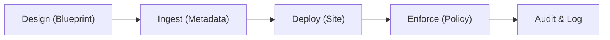

### 3. Distributed Edge Topology
Strategically orchestrating standardized edge sites across global retail regions, diverse factory floors, and multi-cloud targets, providing a unified institutional view of global edge health and operational readiness.

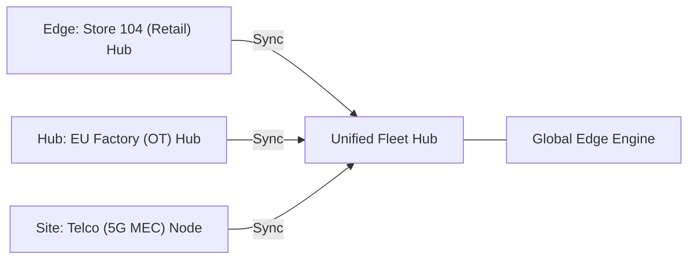

### 4. Edge-to-Cloud Governance & High-Trust Data Plane Protection Flow
Executing complex logic for securing the bridge between edge devices and cloud analytics, ensuring every organizational identity is verified and every telemetry access is according to institutional standards.

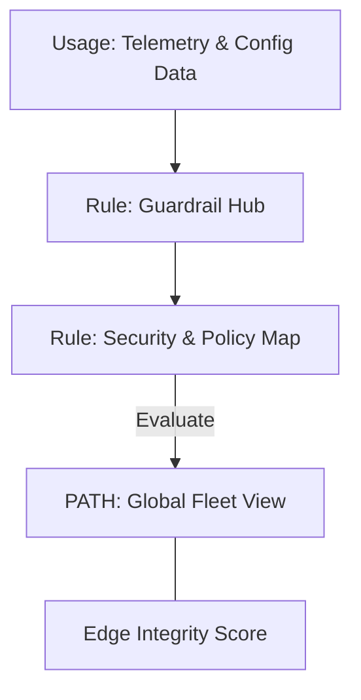

### 5. Multi-Region Edge Federation & Governance Flow
Automatically managing unified edge standards across global regions and diverse telecommunications providers, ensuring institutional data residency and security boundaries by default.

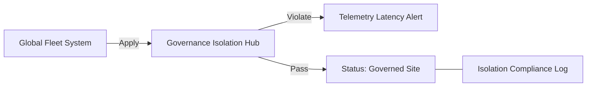

### 6. Encryption & Perimeter Protection Flow (Edge Standard)
Managing the lifecycle of an edge request, automatically enforcing institutional TLS 1.3 and resource encryption standards as required by security policy, ensuring zero-latency security confidence.

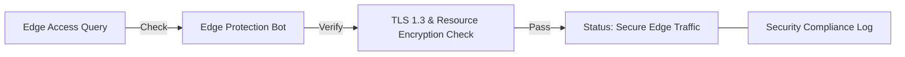

### 7. Institutional Edge Maturity Scorecard
Grading organizational performance based on key indicators: Site Compliance Grade, Hardware Health Adoption Index, and Edge Uptime.

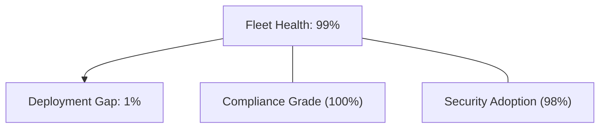

### 8. Identity & RBAC for Edge Governance
Managing fine-grained access to edge hubs, provisioning workers, and audit logs between Edge Architects, Site Operators, and Compliance Leads.

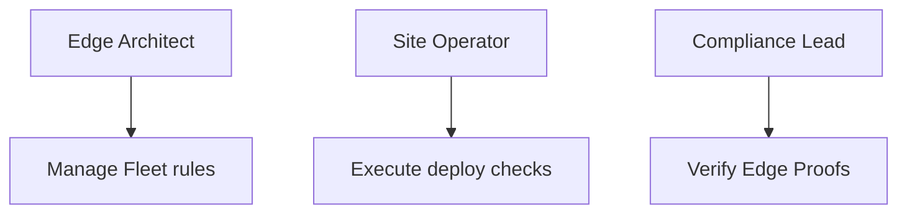

### 9. IaC Deployment: Edge-Computing-Blueprints-as-Code Framework
Using modular Terraform to deploy and manage the versioned distribution of the fleet tracking hubs, policy protection workers, and forensic metadata lakes.

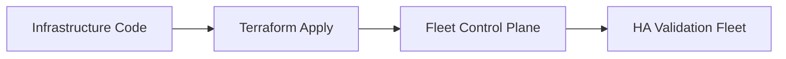

### 10. AIOps Edge Drift & Risk Validation Flow
Using advanced analytics to identify sudden surges in edge telemetry volume, unauthorized site changes, suspicious configuration drifts, or unusual deployment pattern changes that could result in institutional risk.

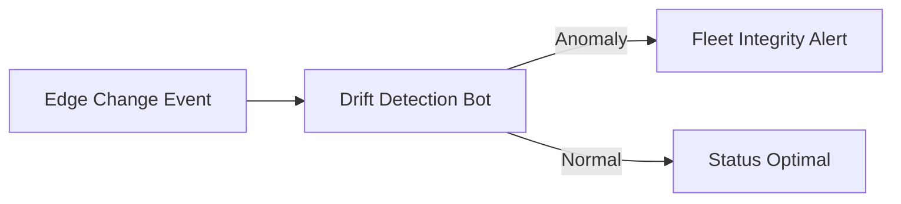

### 11. Metadata Lake for Forensic Edge Audit
Storing long-term records of every edge site generated (metadata), every security event recorded, and every blueprint version history for institutional record-keeping, compliance auditing, and post-provisioning forensics.

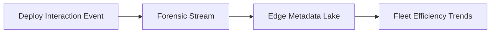

---

## 🏛️ Core Governance Pillars

1.  **Unified Foundation Coordination**: Maximizing resilience by centralizing all fleet measurement through a single institutional plane.
2.  **Automated Edge Provisioning**: Eliminating "manual site" scenarios through proactive orchestration and pattern verification.
3.  **Sequential Blueprint Intelligence**: Ensuring zero-interruption operations through dependency-aware blueprint-driven fleet engineering.
4.  **Zero-Trust Guardrail Protection**: Automatically enforcing identity-based access and rule evaluation across all edge tiers.
5.  **Autonomous Operations Logic**: Guaranteeing reliability through automated industry-specific fleet monitoring runbooks.
6.  **Full Edge Auditability**: Immutable recording of every blueprint change and site provision for institutional forensics.

---

## 🛠️ Technical Stack & Implementation

### Edge Engine & APIs
*   **Framework**: Python 3.11+ / FastAPI.
*   **Performance Engine**: Custom Python-based logic for multi-region fleet provisioning and DORA-style readiness metrics.
*   **Integrations**: Native connectors for Azure IoT, AWS Greengrass, and GCP Edge APIs.
*   **Persistence**: PostgreSQL (Fleet Ledger) and Redis (Live Policy State).
*   **Auth Orchestrator**: Federated OIDC/SAML for least-privilege edge management access.

### Governance Dashboard (UI)
*   **Framework**: React 18 / Vite.
*   **Theme**: Dark, Slate, Indigo (Modern high-fidelity fleet aesthetic).
*   **Visualization**: D3.js for edge topologies and Recharts for readiness velocity analytics.

### Infrastructure & DevOps
*   **Runtime**: AWS EKS or Azure Kubernetes Service (AKS) for management plane.
*   **Fleet Hub**: Managed event sourcing for immutable edge security timeline reconstruction.
*   **IaC**: Modular Terraform for deploying the edge blueprint engine and validation fleet.

---

## 🏗️ IaC Mapping (Module Structure)

| Module | Purpose | Real Services |
| :--- | :--- | :--- |
| **`infrastructure/fleet_hub`** | Central management plane | EKS, PostgreSQL, Redis |
| **`infrastructure/enforcers`** | Distributed fleet provisioners | Azure IoT, AWS, GCP APIs |
| **`infrastructure/blueprint_pipes`** | Blueprint Ingestion Hubs | Webhooks, Lambda |
| **`infrastructure/auditing`** | Forensic fleet sinks | S3, Athena, Quicksight |

---

## 🚀 Deployment Guide

### Local Principal Environment
```bash
# Clone the blueprints repository
git clone https://github.com/devopstrio/edge-computing-blueprints.git
cd edge-computing-blueprints

# Configure environment
cp .env.example .env

# Launch the Edge stack
make init

# Trigger a mock blueprint update and automated guardrail validation simulation
make simulate-edge
```

Access the Management Portal at `http://localhost:3000`.

---

## 📜 License
Distributed under the MIT License. See `LICENSE` for more information.

---
<div align="center">
  <p>© 2026 Devopstrio. All rights reserved.</p>
</div>
